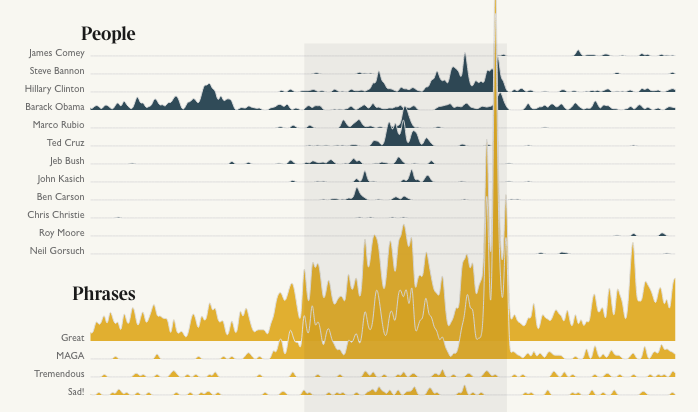

# Joyplot chart



An alternative to small multiple to present timeseries of frequencies.

# Data format

An array of objects containing, at least, a date, a frequency, and a label:

```
[
{"week":"2013-12-15","n":"10","label":"James Comey"},
{"week":"2013-12-22","n":"15","label":"James Comey"},
{"week":"2013-12-15","n":"1","label":"Hillary Clinton"},
{"week":"2013-12-22","n":"5","label":"Hillary Clinton"},
]
```

## Download and edit

Install the [SVG Crowbar](http://nytimes.github.io/svg-crowbar/) by dragging the bookmarklet on this page to your bookmarks bar. Click the bookmarklet to download an Illustrator-ready SVG.
