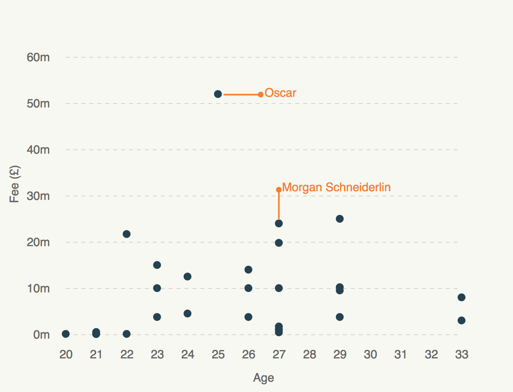

# Scatterplot



A simple bubble scatterplot.

## Data format

#### for d3

An array of objects containing two key/value pairs for the x-axis and y-axis.

```
  [{
    "Age": "22",
    "Fee": "12"
  },{
    "Age": "23",
    "Fee": "24"
  },
  (...)
  ]
```

#### for R

A CSV file containing at least two variables (columns).

```
Name,Fee,Age
Glenn Murray,3,33
Lukas Jutkiewicz,1,27
Danny Lafferty,0.43,27
```

## Annotations

At the top of `script.js`, an array of objects contains the annotation layer.

Un-comment line 119 (`draggable(true)`) and refresh to manually drag and edit your annotations. Once you're happy, run `copy(annotations)` in the console and paste into `annotations` at the top of `script.js`.

Annotations are added manually in R.

## Download and edit

Install the [SVG Crowbar](http://nytimes.github.io/svg-crowbar/) by dragging the bookmarklet on this page to your bookmarks bar. Click the bookmarklet to download an Illustrator-ready SVG.
