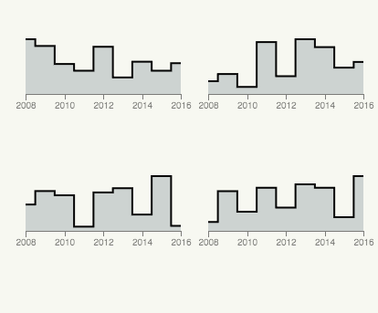

# Small multiples



"series of similar graphs or charts using the same scale and axes, allowing them to be easily compared. It uses multiple views to show different partitions of a dataset." (Wikipedia)

## Data format

```
[
  {
    date: 2008,
    value: 10,
    facet: "foo"
  },
  {
    date: 2009,
    value: 20,
    facet: "foo"
  },
  {
    date: 2008,
    value: 1,
    facet: "bar"
  },
  {
    date: 2009,
    value: 10,
    facet: "bar"
  },
]
```

## Download and edit

Install the [SVG Crowbar](http://nytimes.github.io/svg-crowbar/) by dragging the bookmarklet on this page to your bookmarks bar. Click the bookmarklet to download an Illustrator-ready SVG.
