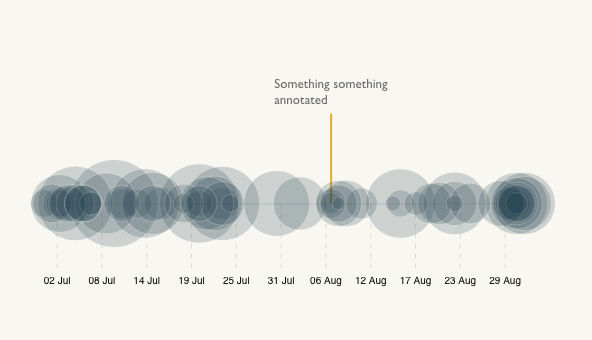

# Timeline of bubbles



A simple yet slightly original timeline

## Data format

#### for d3

An array of objects containing at least two key/value pairs.

```
  [{
    "Date": "01/07/2017",
    "Fee": "5.4",
  },{
    "Date": "02/07/2017",
    "Fee": "12",
  },
  (...)
  ]
```

## Download and edit

Install the [SVG Crowbar](http://nytimes.github.io/svg-crowbar/) by dragging the bookmarklet on this page to your bookmarks bar. Click the bookmarklet to download an Illustrator-ready SVG.
