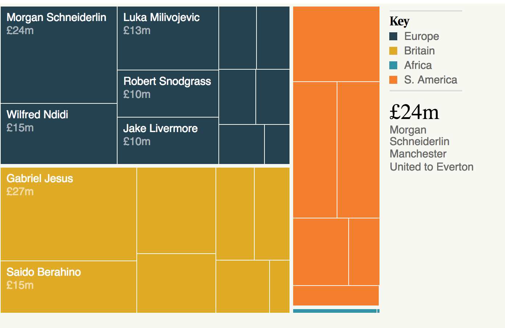

# Treemap



A treemap recursively subdivides area into rectangles; the area of any node in the tree corresponds to its value.

Use to represent hierarchies.

## Data format

The data format must be a hierarchical representation.

```
{
  "name": "transfers_position_in",
  "children": [
    {
      "name": "Defender",
      "children": [
        {
          "name": "Cohen Bramall",
          "fee": "0.04",
          "fromto": "Hednesford Town to Arsenal",
          "position": "Defender",
          "id": "transfers_position_in.Defender.Cohen Bramall"
        },
        (..)
        ],
      "id": "transfers_position_in.Defender"
    },
    {
      "name": "Goalkeeper",
      "children": [
        {
          "name": "Aaron Ramsdale",
          "fee": "0.04",
          "fromto": "Sheffield United to Bournemouth",
          "position": "Goalkeeper",
          "id": "transfers_position_in.Goalkeeper.Aaron Ramsdale"
        },
        (...)
        ],
      "id": "transfers_position_in.Goalkeeper"
    },
    (...)
  ],
  "id": "transfers_position_in"
}
```

## Download and edit

Install the [SVG Crowbar](http://nytimes.github.io/svg-crowbar/) by dragging the bookmarklet on this page to your bookmarks bar. Click the bookmarklet to download an Illustrator-ready SVG.
