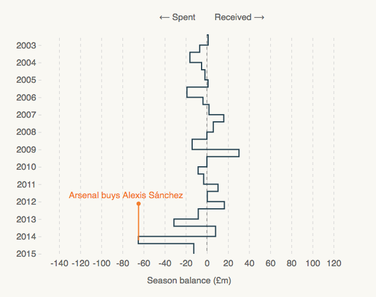

# Vertical steppy line



A vertical line chart build for January 2017 Transfer Window, complete with Times-esque annotations.

## Data format

An array of objects containing a _date_ (on the y-axis) and a _value_ (on the x-axis).

```
  [{
    "year": "2002/06",
    "value": "-0.09"
  },{
    "year": "2003/01",
    "value": "1.19"
  },
  (...)
  ]
```

## Annotations

At the top of `script.js`, an array of objects contains the annotation layer.

Un-comment line 119 (`draggable(true)`) and refresh to manually drag and edit your annotations. Once you're happy, run `copy(annotations)` in the console and paste into `annotations` at the top of `script.js`.
