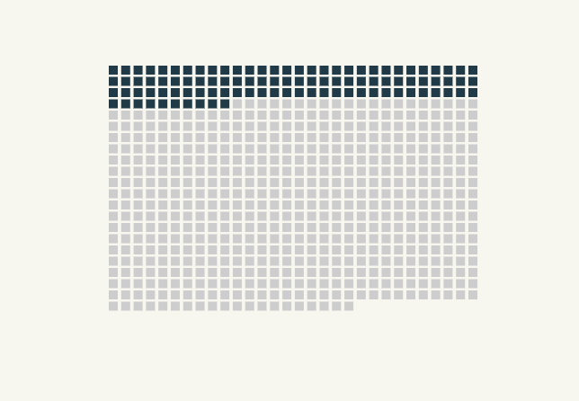

# Waffle chart



An alternative to the pie chart to represent proportions and shares.

## Data format

#### for d3

A simple array would do and would draw `array.length` elements

```
  ['one rectangle', 'two rectangles', ...]
```

In this example we pass an array of objects to store some properties, such as wether to highlight the squares or circles

```
  [
    { highlight: true },
    { highlight: true },
    { highlight: true },
    { highlight: true },
    { highlight: false},
  ]
```


## Download and edit

Install the [SVG Crowbar](http://nytimes.github.io/svg-crowbar/) by dragging the bookmarklet on this page to your bookmarks bar. Click the bookmarklet to download an Illustrator-ready SVG.
